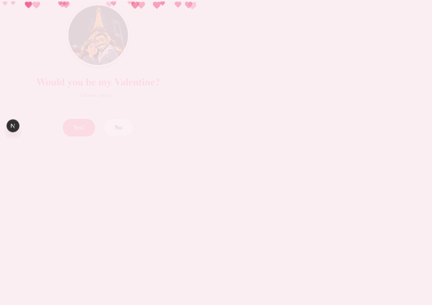
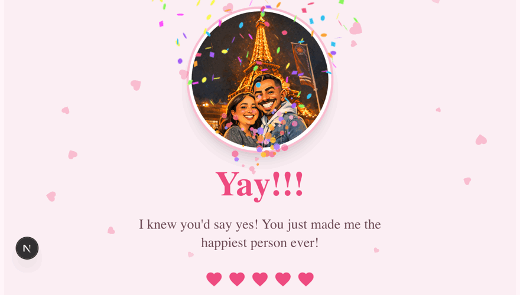
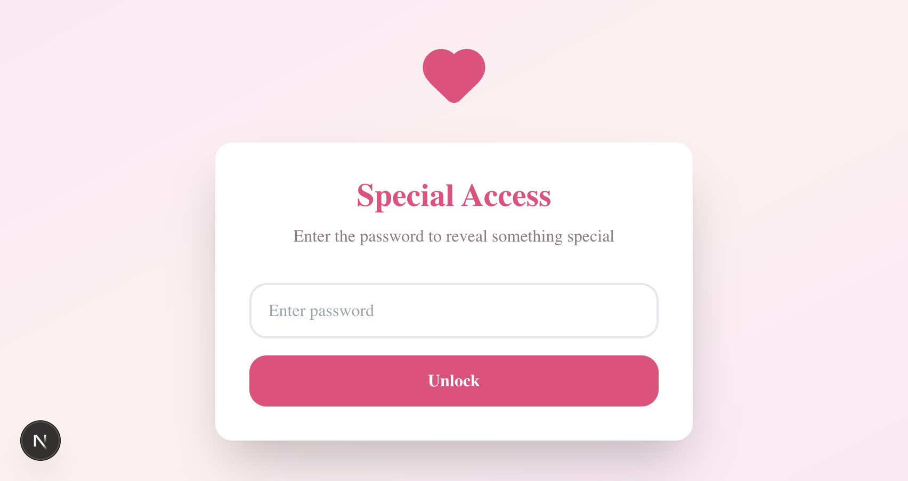
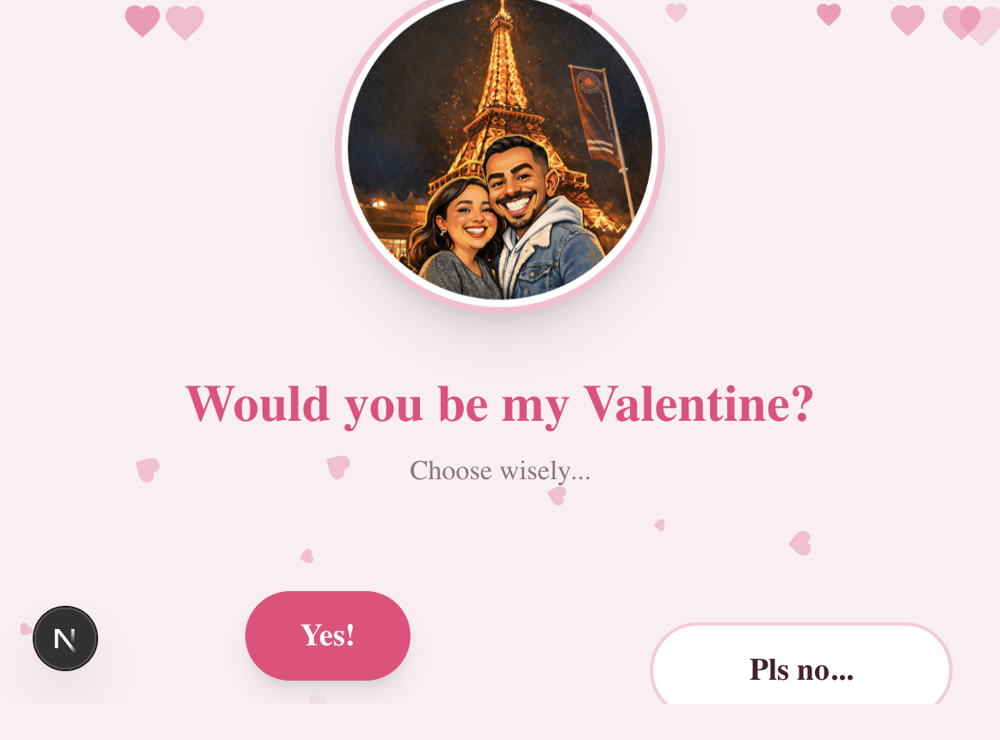
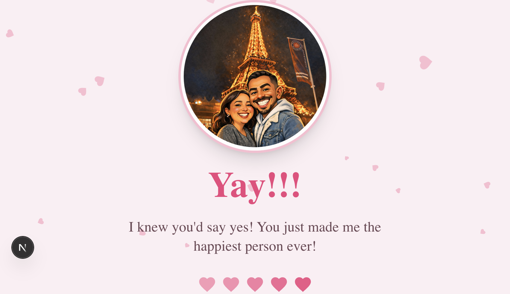

# Be My Valentine?

A small, interactive Valentine's Day proposal built with Next.js. The experience starts with a passcode gate, moves into a playful Yes/No proposal, and ends with a confetti celebration. It is designed as a personal, shareable surprise rather than a general-purpose authentication system.

## Animation Demos

| Runaway No button | Confetti celebration |
| --- | --- |
|  |  |

These looping GIFs are recordings of the running app: the first shows the No button dodging the pointer and changing its message, and the second shows the confetti animation immediately after accepting.

## Screenshots

| Password gate | Valentine prompt | Celebration |
| --- | --- | --- |
|  |  |  |

## What You Can Do

- Unlock the proposal with a passcode; an incorrect entry shows inline feedback.
- Accept with the Yes button to trigger confetti, synthesized sound, and the celebration screen.
- Move the pointer near No to make it dodge, spin, and change its message. On touch screens, tapping it makes it flee.
- Click No to make it disappear and bring forward a larger Yes button.
- See floating hearts behind the proposal and a personal illustration in both proposal and celebration states.
- Use the page on desktop or mobile; the runaway interaction supports pointer and touch input.
- Hear short Web Audio tones synthesized in the browser for the flee and celebration sounds; no audio files are required.

## Built With

- [Next.js](https://nextjs.org/) 16 and React 19
- TypeScript
- Tailwind CSS
- Framer Motion
- `canvas-confetti`
- Lucide icons

## Getting Started

### Requirements

- Node.js 20.9 or newer
- pnpm

### Install and run locally

```bash
pnpm install --frozen-lockfile
pnpm dev
```

Open [http://localhost:3000](http://localhost:3000) in your browser.

The access code is currently defined in `components/password-gate.tsx`; update it there before sharing a customized version.

### Production build

```bash
pnpm build
pnpm start
```

## Project Structure

```text
app/                   Page entry point, metadata, and global styles
components/            Proposal card, password gate, interactions, and effects
docs/gifs/             Recorded animation demos embedded above
docs/screenshots/      Static screenshots of the main app states
hooks/                 Shared React hooks
lib/                   Shared helpers
public/                Static images and optional sound assets
```

## Customization

| Customize | File or location |
| --- | --- |
| Passcode and access-gate text | `components/password-gate.tsx` |
| Proposal and celebration messages | `components/valentine-card.tsx` |
| Runaway button messages and behavior | `components/runaway-button.tsx` |
| Illustration | Replace the image in `public/` and update its reference in `components/valentine-card.tsx` |
| Colors and global styling | `app/globals.css` |
| Browser title and description | `app/layout.tsx` |
| Synthesized sound frequencies | `components/use-sounds.tsx` |

The passcode check runs in client-side code, so the code can be inspected in the browser. It is suitable for a playful reveal but is not a security boundary; do not use it to protect private content.

## Available Scripts

| Command | Description |
| --- | --- |
| `pnpm dev` | Start the development server |
| `pnpm build` | Create a production build |
| `pnpm start` | Serve the production build |
| `pnpm lint` | Run ESLint |